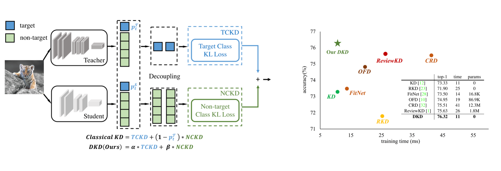

<div align=center><div align=left>

This repo is

(1) a PyTorch library that provides classical knowledge distillation algorithms on mainstream CV benchmarks,

(2) the official implementation of the CVPR-2022 paper: [Decoupled Knowledge Distillation](https://arxiv.org/abs/2203.08679).


# Decoupled Knowledge Distillation

### Framework & Performance

<div style="text-align:center"></div>

### Main Benchmark Results

On CIFAR-100:


| Teacher <br> Student |ResNet56 <br> ResNet20|ResNet110 <br> ResNet32| ResNet32x4 <br> ResNet8x4| WRN-40-2 <br> WRN-16-2| WRN-40-2 <br> WRN-40-1 | VGG13 <br> VGG8|
|:---------------:|:-----------------:|:-----------------:|:-----------------:|:------------------:|:------------------:|:--------------------:|
| KD | 70.66 | 73.08 | 73.33 | 74.92 | 73.54 | 72.98 |
| **DKD** | **71.97** | **74.11** | **76.32** | **76.23** | **74.81** | **74.68** |


| Teacher <br> Student |ResNet32x4 <br> ShuffleNet-V1|WRN-40-2 <br> ShuffleNet-V1| VGG13 <br> MobileNet-V2| ResNet50 <br> MobileNet-V2| ResNet32x4 <br> MobileNet-V2|
|:---------------:|:-----------------:|:-----------------:|:-----------------:|:------------------:|:------------------:|
| KD | 74.07 | 74.83 | 67.37 | 67.35 | 74.45 |
| **DKD** | **76.45** | **76.70** | **69.71** | **70.35** | **77.07** |


On ImageNet:

| Teacher <br> Student |ResNet34 <br> ResNet18|ResNet50 <br> MobileNet-V1|
|:---------------:|:-----------------:|:-----------------:|
| KD | 71.03 | 70.50 | 
| **DKD** | **71.70** | **72.05** |

# MDistiller

### Introduction

MDistiller supports the following distillation methods on CIFAR-100, ImageNet and MS-COCO:
|Method|Paper Link|CIFAR-100|ImageNet|MS-COCO|
|:---:|:---:|:---:|:---:|:---:|
|KD| <https://arxiv.org/abs/1503.02531> |&check;|&check;| |
|FitNet| <https://arxiv.org/abs/1412.6550> |&check;| | |
|AT| <https://arxiv.org/abs/1612.03928> |&check;|&check;| |
|NST| <https://arxiv.org/abs/1707.01219> |&check;| | |
|PKT| <https://arxiv.org/abs/1803.10837> |&check;| | |
|KDSVD| <https://arxiv.org/abs/1807.06819> |&check;| | |
|OFD| <https://arxiv.org/abs/1904.01866> |&check;|&check;| |
|RKD| <https://arxiv.org/abs/1904.05068> |&check;| | |
|VID| <https://arxiv.org/abs/1904.05835> |&check;| | |
|SP| <https://arxiv.org/abs/1907.09682> |&check;| | |
|CRD| <https://arxiv.org/abs/1910.10699> |&check;|&check;| |
|ReviewKD| <https://arxiv.org/abs/2104.09044> |&check;|&check;|&check;|
|DKD| <https://arxiv.org/abs/2203.08679> |&check;|&check;|&check;|


### Installation

Environments:

- Python 3.6
- PyTorch 1.9.0
- torchvision 0.10.0

Install the package:

```
sudo pip3 install -r requirements.txt
sudo python3 setup.py develop
```

### Getting started

0. Wandb as the logger

- The registeration: <https://wandb.ai/home>.
- If you don't want wandb as your logger, set `CFG.LOG.WANDB` as `False` at `mdistiller/engine/cfg.py`.

1. Evaluation

- You can evaluate the performance of our models or models trained by yourself.

- Our models are at <https://github.com/megvii-research/mdistiller/releases/tag/checkpoints>, please download the checkpoints to `./download_ckpts`

- If test the models on ImageNet, please download the dataset at <https://image-net.org/> and put them to `./data/imagenet`

  ```bash
  # evaluate teachers
  python3 tools/eval.py -m resnet32x4 # resnet32x4 on cifar100
  python3 tools/eval.py -m ResNet34 -d imagenet # ResNet34 on imagenet
  
  # evaluate students
  python3 tools/eval.p -m resnet8x4 -c download_ckpts/dkd_resnet8x4 # dkd-resnet8x4 on cifar100
  python3 tools/eval.p -m MobileNetV1 -c download_ckpts/imgnet_dkd_mv1 -d imagenet # dkd-mv1 on imagenet
  python3 tools/eval.p -m model_name -c output/your_exp/student_best # your checkpoints
  ```


2. Training on CIFAR-100

- Download the `cifar_teachers.tar` at <https://github.com/megvii-research/mdistiller/releases/tag/checkpoints> and untar it to `./download_ckpts` via `tar xvf cifar_teachers.tar`.

  ```bash
  # for instance, our DKD method.
  python3 tools/train.py --cfg configs/cifar100/dkd/res32x4_res8x4.yaml

  # you can also change settings at command line
  python3 tools/train.py --cfg configs/cifar100/dkd/res32x4_res8x4.yaml SOLVER.BATCH_SIZE 128 SOLVER.LR 0.1
  ```

3. Training on ImageNet

- Download the dataset at <https://image-net.org/> and put them to `./data/imagenet`

  ```bash
  # for instance, our DKD method.
  python3 tools/train.py --cfg configs/imagenet/r34_r18/dkd.yaml
  ```

4. Training on MS-COCO

- see [detection.md](detection/README.md)


5. Extension: Visualizations

- Jupyter notebooks: [tsne](tools/visualizations/tsne.ipynb) and [correlation_matrices](tools/visualizations/correlation.ipynb)


### Custom Distillation Method

1. create a python file at `mdistiller/distillers/` and define the distiller
  
  ```python
  from ._base import Distiller

  class MyDistiller(Distiller):
      def __init__(self, student, teacher, cfg):
          super(MyDistiller, self).__init__(student, teacher)
          self.hyper1 = cfg.MyDistiller.hyper1
          ...

      def forward_train(self, image, target, **kwargs):
          # return the output logits and a Dict of losses
          ...
      # rewrite the get_learnable_parameters function if there are more nn modules for distillation.
      # rewrite the get_extra_parameters if you want to obtain the extra cost.
    ...
  ```

2. regist the distiller in `distiller_dict` at `mdistiller/distillers/__init__.py`

3. regist the corresponding hyper-parameters at `mdistiller/engines/cfg.py`

4. create a new config file and test it.

# Citation

If this repo is helpful for your research, please consider citing the paper:

```BibTeX
@article{zhao2022dkd,
  title={Decoupled Knowledge Distllation},
  author={Zhao, Borui and Cui, Quan and Song, Renjie and Qiu, Yiyu and Liang, Jiajun},
  journal={arXiv preprint arXiv:2203.08679},
  year={2022}
}
```

# License

MDistiller is released under the MIT license. See [LICENSE](LICENSE) for details.

# Acknowledgement

- Thanks for CRD and ReviewKD. We build this library based on the [CRD's codebase](https://github.com/HobbitLong/RepDistiller) and the [ReviewKD's codebase](https://github.com/dvlab-research/ReviewKD).

- Thanks Yiyu Qiu and Yi Shi for the code contribution during their internship in MEGVII Technology.

- Thanks Xin Jin for the discussion about DKD.
